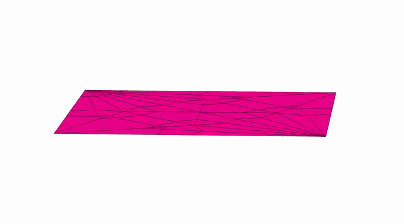
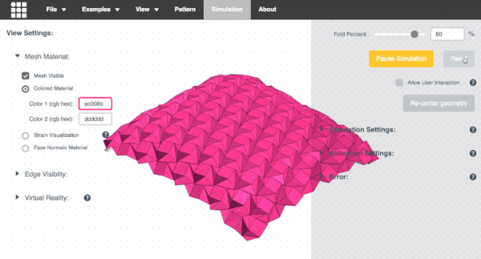
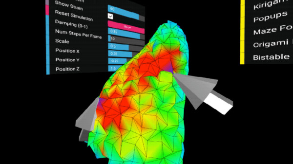

# OrigamiSimulator

Live demo at <a href="https://origamisimulator.org/">origamisimulator.org</a> 

This app allows you to simulate how any origami crease pattern will fold.  It may look a little different
from what you typically think of as "origami" - rather than folding paper in a set of sequential steps,
this simulation attempts to fold every crease simultaneously. It does this by iteratively solving for small displacements in the geometry of an initially flat sheet due to forces
exerted by creases.
You can read more about it in our paper:
<ul>
<li><a target="_blank" href="http://erikdemaine.org/papers/OrigamiSimulator_Origami7/">Fast, Interactive Origami Simulation using GPU Computation</a> by Amanda Ghassaei, Erik Demaine, and Neil Gershenfeld (7OSME)
</ul>

**If you have feedback about features you want to see in this app, please see [this thread](https://github.com/amandaghassaei/OrigamiSimulator/discussions/41).**

All simulation methods were written from scratch and are executed in parallel in several GPU fragment shaders for fast performance.
The solver extends work from the following sources:
<ul>
<li><a target="_blank" href="http://www3.eng.cam.ac.uk/~sdg/preprint/5OSME.pdf">Origami Folding: A Structural Engineering Approach</a> by Mark Schenk and Simon D. Guest 
<li><a target="_blank" href="http://www.tsg.ne.jp/TT/cg/TachiFreeformOrigami2010.pdf">Freeform Variations of Origami</a> by Tomohiro Tachi 
</ul>

This app also uses the methods described in <a href="http://www.cgg.cs.tsukuba.ac.jp/projects/2020/RulingAwareTriangulation/index.html" target="_blank">Simple Simulation of Curved Folds Based on Ruling-aware Triangulation</a> to import curved crease patterns and pre-process them in a way that realistically simulates the bending between the creases.

Originally built by <a href="http://www.amandaghassaei.com/" target="_blank">Amanda Ghassaei</a> as a final project for <a href="http://courses.csail.mit.edu/6.849/spring17/" target="_blank">Geometric Folding Algorithms</a>.
Other contributors include <a href="http://www.cgg.cs.tsukuba.ac.jp/~sasaki_k/" target="_blank">Sasaki Kosuke</a>, <a href="http://erikdemaine.org/" target="_blank">Erik Demaine</a>, and <a href="https://github.com/amandaghassaei/OrigamiSimulator/graphs/contributors" target="_blank">others</a>.
Code available on <a href="https://github.com/amandaghassaei/OrigamiSimulator" target="_blank">Github</a>.  If you have interesting crease patterns that would
make good demo files, please send them to me (Amanda) so I can add them to the <b>Examples</b> menu.  My email address is on my website.  Thanks! 

 
<b>Instructions:</b>  
 

<ul>
    <li>Slide the <b>Fold Percent</b> slider to control the degree of folding of the pattern (100% is fully folded, 0% is unfolded,
        and -100% is fully folded with the opposite mountain/valley assignments).</li>
    <li>Drag to rotate the model, scroll to zoom.</li>
    <li>Import other patterns under the <b>Examples</b> menu.</li>
    <li>Upload your own crease patterns in SVG or <a href="https://github.com/edemaine/fold" target="_blank">FOLD</a> formats, following <a href="#" class="goToImportInstructions">these instructions</a>.</li>
    <li>Export FOLD files or 3D models ( STL or OBJ ) of the folded state of your design ( <b>File > Save Simulation as...</b> ).</li>
</ul>
    
<ul>
    <li>Visualize the internal strain of the origami as it folds using the <b>Strain Visualization</b> in the left menu of the <b>Advanced Options</b>.</li>
</ul>
     
<ul>
    <li>If you are working from a computer connected to a VR headset and hand controllers, follow <a href="#" id="goToViveInstructions">these instructions</a>
        to use this app in an interactive virtual reality mode. (sorry I think this may be deprecated now!)</li>
</ul>

 
<b>External Libraries:</b>  
<ul>
    <li>All rendering and 3D interaction done with <a target="_blank" href="https://threejs.org/">three.js</a></li>
    <li><a href="https://github.com/fontello/svgpath" target="_blank">svgpath</a> and <a href="https://www.npmjs.com/package/path-data-polyfill" target="_blank">path-data-polyfill</a> helps with SVG path parsing</li>
    <li><a href="https://github.com/edemaine/fold" target="_blank">FOLD</a> is used as the internal data structure, methods from the
        <a href="https://github.com/edemaine/fold/blob/master/doc/api.md" target="_blank">FOLD API</a> used for SVG parsing</li>
    <li>Arbitrary polygonal faces of imported geometry are triangulated using the <a target="_blank" href="https://github.com/mapbox/earcut">Earcut Library</a> and cdt2d</a></li>
    <li><a href="http://www.numericjs.com/" target="_blank">numeric.js</a> for linear algebra operations</li>
    <li>GIF and WebM video export uses <a target="_blank" href="https://github.com/spite/ccapture.js/">CCapture</a></li>
</ul>

 
You can find additional information in <a href="http://erikdemaine.org/papers/OrigamiSimulator_Origami7/" target="_blank">our 7OSME paper</a> and <a href="http://www.amandaghassaei.com/projects/origami_simulator/" target="_blank">project website</a>.
If you have feedback about features you want to see in this app, please see <a href="https://github.com/amandaghassaei/OrigamiSimulator/discussions/41" target="_blank">this thread</a>.
 

